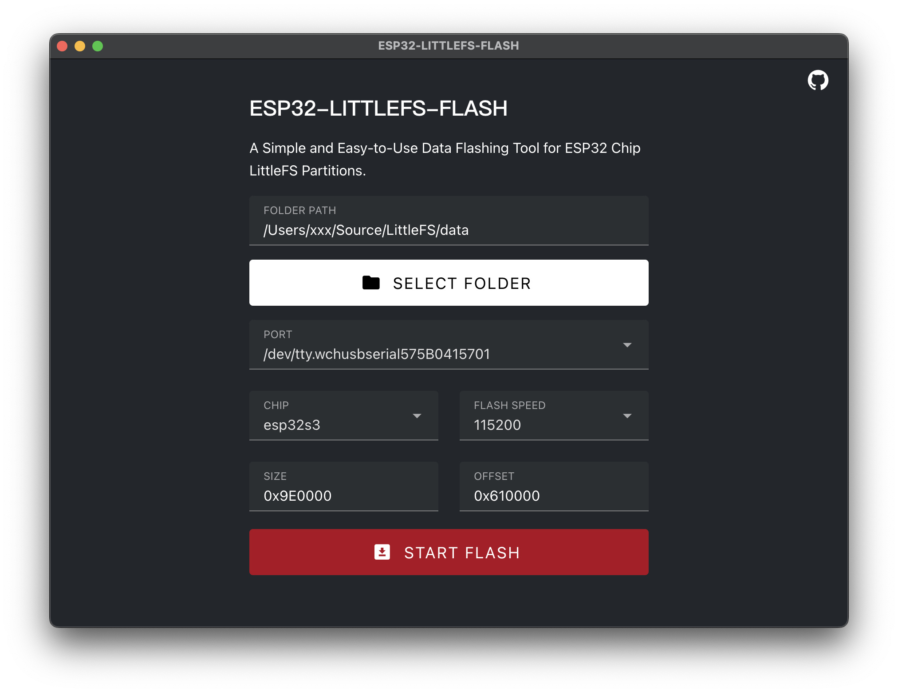

<div id="top">
<p align="center">
  

  <h1 align="center">ESP32-LittleFS-Flash</h1>
</p>
</div>
<div align="center">

[](https://github.com/Tomosawa/ESP32-LittleFS-Flash)
[](https://github.com/Tomosawa/ESP32-LittleFS-Flash)
[](https://github.com/Tomosawa/ESP32-LittleFS-Flash/issues)
[](https://github.com/Tomosawa/ESP32-LittleFS-Flash/issues)
[](https://github.com/Tomosawa/ESP32-LittleFS-Flash/graphs/contributors)
[](https://github.com/Tomosawa/ESP32-LittleFS-Flash/blob/master/LICENSE)

English | [简体中文](README_Zh-CN.md) 

</div>


ESP32-LittleFS-Flash is a cross-platform tool for flashing LittleFS partitions onto ESP32 chips. This tool features a graphical interface that simplifies the flashing process by allowing you to select a folder for flashing.

## Table of Contents

- [Features](#features)
- [Requirements](#requirements)
- [Installation](#installation)
- [Usage](#usage)
- [Configuration](#configuration)
- [Development](#development)
- [Contributing](#contributing)
- [License](#license)
- [Acknowledgements](#acknowledgements)

## Features

- Easy flashing of LittleFS partitions onto ESP32.
- Cross-platform support (Windows, macOS, Linux).
- User-friendly folder selection interface.
- Reliable and efficient flashing process.

## Requirements

- ESP32 development board.
- Support Chip: esp8266,esp32,esp32s2,esp32s3beta2,esp32s3,esp32c3,esp32c6beta,esp32h2beta1,esp32h2beta2,esp32c2,esp32c6,esp32h2,esp32p4

## Installation

1. Go to the [Releases](https://github.com/Tomosawa/ESP32-LittleFS-Flash/releases) page and download the installation package or binary file for your operating system.
2. Extract the downloaded files.
3. Run the extracted executable file.

## Usage

1. Connect the ESP32 development board to your computer.
2. Open the ESP32-LittleFS-Flash application.
3. In the application interface, select the folder to be flashed and specify the port to which the ESP32 is connected.
4. Set the LittleFS partition size and flash address offset according to your partition table.
5. Click the "Start Flashing" button and wait for the flashing process to complete.

For example, for the ESP32-S3-WROOM-N16R8 chip with a flash capacity of 16MB, assume your partition table is defined as follows:

| Name      | Type | SubType   | Offset  | Size     | Flags  |
|-----------|------|-----------|---------|----------|--------|
| nvs       | data | nvs       | 0x9000  | 0x5000   |        |
| otadata   | data | ota       | 0xe000  | 0x2000   |        |
| app0      | app  | ota_0     | 0x10000 | 0x300000 |        |
| app1      | app  | ota_1     | 0x310000| 0x300000 |        |
| littlefs  | data | spiffs    | 0x610000| 0x9E0000 |        |
| coredump  | data | coredump  | 0xFF0000| 0x10000  |        |

In this software, the image `SIZE` can be set to 0x9E0000, and the `OFFSET` address can be set to 0x610000.

## Configuration

Configuration options are available directly in the software interface, including:

- `FOLDER PATH`: The folder to be flashed.
- `PORT`: The serial port for flashing.
- `CHIP`: The ESP32 chip type.
- `FLASH SPEED`: The baud rate for the flashing communication.
- `SIZE`: The size of the LittleFS partition to be flashed. Ensure the folder size does not exceed the partition size.
- `OFFSET`: The offset address for the LittleFS partition to be flashed.

## Development

This project is built using [Electron+Vite](https://electron-vite.org/), with Vue components powered by [Vuetify](https://vuetifyjs.com/).
If you want to contribute to the development, follow these steps:

1. Clone the repository locally:

```bash
git clone https://github.com/Tomosawa/ESP32-LittleFS-Flash.git
cd ESP32-LittleFS-Flash
```

2. Install the required dependencies:

```bash
npm install
```

3. Start the development server:

```bash
npm run dev
```

## Contributing

We welcome contributions to enhance the ESP32-LittleFS-Flash tool. If you have any suggestions, bug reports, or feature requests, please open an issue on the GitHub repository. To contribute code, please follow these steps:

1. Fork the repository.
2. Create a new branch: `git checkout -b feature/your-feature`.
3. Make your changes and commit them: `git commit -m 'Add some feature'`.
4. Push to the branch: `git push origin feature/your-feature`.
5. Open a pull request.

## License

This project is licensed under the GNU General Public License v3.0. See the [LICENSE](LICENSE) file for more details.

## Acknowledgements

The binary files included in the releases are sourced from the following projects:
- [esptool](https://github.com/espressif/esptool)
- [mklittlefs](https://github.com/earlephilhower/mklittlefs)

---

Thank you for using ESP32-LittleFS-Flash! If you encounter any issues or have any questions, please feel free to contact me.

---