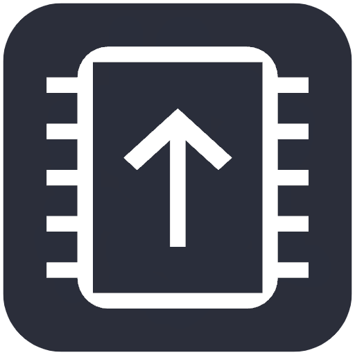
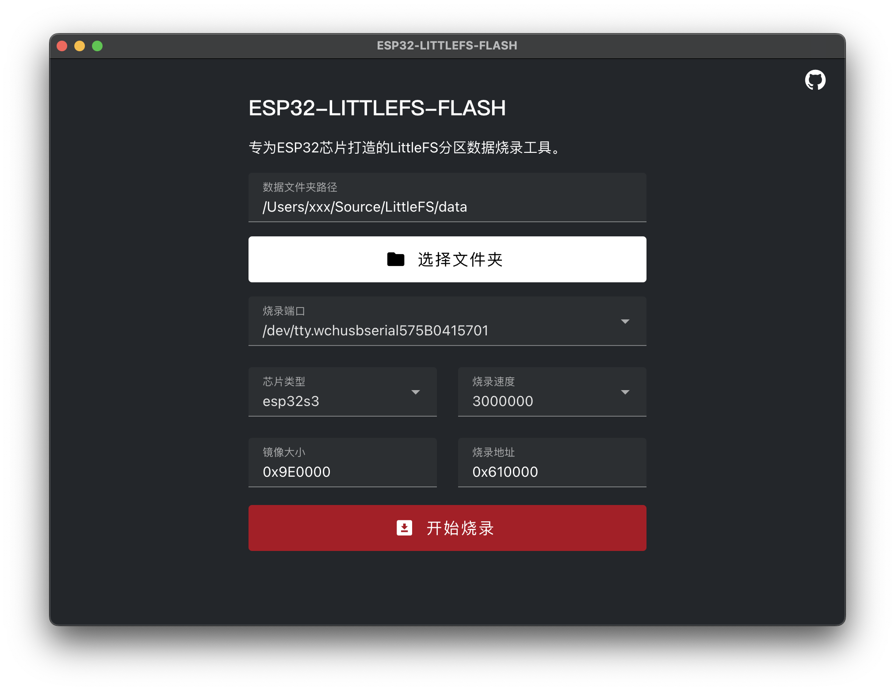

<div id="top">
<p align="center">
  

  <h1 align="center">ESP32-LittleFS-Flash</h1>
</p>
</div>
<div align="center">

[](https://github.com/Tomosawa/ESP32-LittleFS-Flash)
[](https://github.com/Tomosawa/ESP32-LittleFS-Flash)
[](https://github.com/Tomosawa/ESP32-LittleFS-Flash/issues)
[](https://github.com/Tomosawa/ESP32-LittleFS-Flash/issues)
[](https://github.com/Tomosawa/ESP32-LittleFS-Flash/graphs/contributors)
[](https://github.com/Tomosawa/ESP32-LittleFS-Flash/blob/master/LICENSE)

[English](README.md) | 简体中文

</div>

ESP32-LittleFS-Flash 是一个用于将 LittleFS 分区烧录到 ESP32 芯片上的跨平台工具。该工具具有图形化的界面
使烧录过程更加简便，只需选择一个文件夹即可进行烧录操作。

## 目录

- [功能](#功能)
- [需求](#需求)
- [安装](#安装)
- [使用](#使用)
- [配置](#配置)
- [开发](#开发)
- [贡献](#贡献)
- [许可证](#许可证)
- [致谢](#致谢)

## 功能

- 轻松将 LittleFS 分区烧录到 ESP32。
- 跨平台支持（Windows、macOS、Linux）。
- 用户友好的文件夹选择界面。
- 可靠高效的烧录过程。

## 需求

- ESP32 开发板。
- 支持芯片型号esp8266,esp32,esp32s2,esp32s3beta2,esp32s3,esp32c3,esp32c6beta,esp32h2beta1,esp32h2beta2,esp32c2,esp32c6,esp32h2,esp32p4

## 安装

1. 前往 [Releases](https://github.com/Tomosawa/ESP32-LittleFS-Flash/releases) 页面下载适用于您操作系统的安装包或二进制文件。
2. 解压下载的文件。
3. 运行解压后的可执行文件。

## 使用

1. 将 ESP32 开发板连接到计算机。
2. 打开 ESP32-LittleFS-Flash 应用程序。
3. 在应用程序界面中，选择要烧录的文件夹并指定 ESP32 所连接的端口。
4. 根据您的分区表来设定LittleFS分区大小，以及烧录的地址偏移。
5. 点击“开始烧录”按钮，等待烧录完成。

以ESP32-S3-WROOM-N16R8闪存容量为16MB芯片为例，假设您的分区表定义如下：

| Name      | Type | SubType   | Offset  | Size    | Flags  |
|-----------|------|-----------|---------|---------|--------|
| nvs       | data | nvs       | 0x9000  | 0x5000  |        |
| otadata   | data | ota       | 0xe000  | 0x2000  |        |
| app0      | app  | ota_0     | 0x10000 | 0x300000|        |
| app1      | app  | ota_1     | 0x310000| 0x300000|        |
| littlefs  | data | spiffs    | 0x610000| 0x9E0000|        |
| coredump  | data | coredump  | 0xFF0000| 0x10000 |        |

那么，在本软件中，镜像大小可设定为0x9E0000，偏移地址可以设置为0x610000。

## 配置

可以直接在软件界面中进行相关的配置，可用的选项包括：

- `FOLDER PATH`：需要烧录的文件夹，里面存放对应的文件。
- `PORT`：选择要烧录的串行端口。
- `CHIP`: 选择您的芯片型号。
- `FLASH SPEED`：选择烧录的通信的波特率。
- `SIZE`：烧录LittleFS分区的大小，注意选择的文件夹大小不可超过分区大小。
- `OFFSET`：烧录的LittleFS分区偏移地址。

## 开发

本项目采用[Electron+vite](https://electron-vite.org/)进行构建，界面采用vue进行开发，UI组件使用的是[vuetify](https://vuetifyjs.com/)
如果您想要进行开发，请按以下步骤操作：

1. 将仓库克隆到本地：

```bash
git clone https://github.com/Tomosawa/ESP32-LittleFS-Flash.git
cd ESP32-LittleFS-Flash
```

2. 安装所需依赖：

```bash
npm install
```

3. 启动开发服务器：

```bash
npm run dev
```

## 贡献

我们欢迎对 ESP32-LittleFS-Flash 工具的贡献。如果您有任何建议、错误报告或功能请求，请在 GitHub 仓库上提出问题。要贡献代码，请按以下步骤操作：

1. Fork 此仓库。
2. 创建一个新分支：`git checkout -b feature/your-feature`。
3. 进行更改并提交：`git commit -m 'Add some feature'`。
4. 推送到分支：`git push origin feature/your-feature`。
5. 创建一个 Pull Request。

## 许可证

本项目使用 GNU 通用公共许可证 v3.0。有关详细信息，请参阅 [LICENSE](LICENSE) 文件。

## 致谢

发布中包含的二进制文件来自以下项目：
- [esptool](https://github.com/espressif/esptool)
- [mklittlefs](https://github.com/earlephilhower/mklittlefs)

感谢这些项目的贡献。

---

感谢您使用 ESP32-LittleFS-Flash！如果遇到任何问题或有任何疑问，请随时联系我。

---